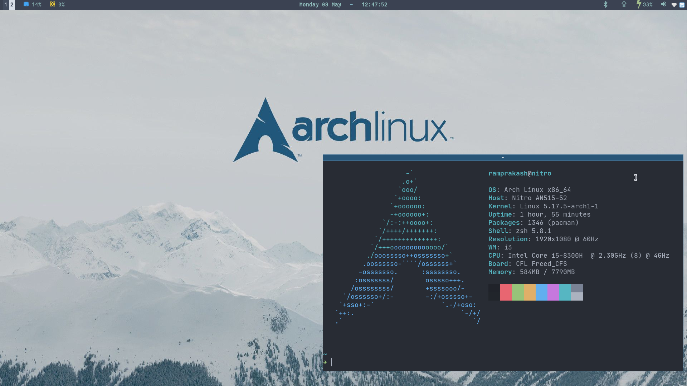
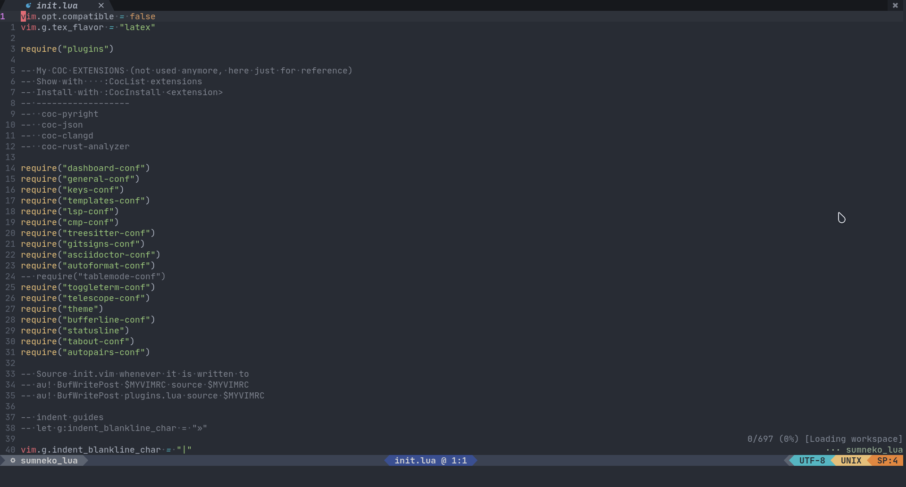
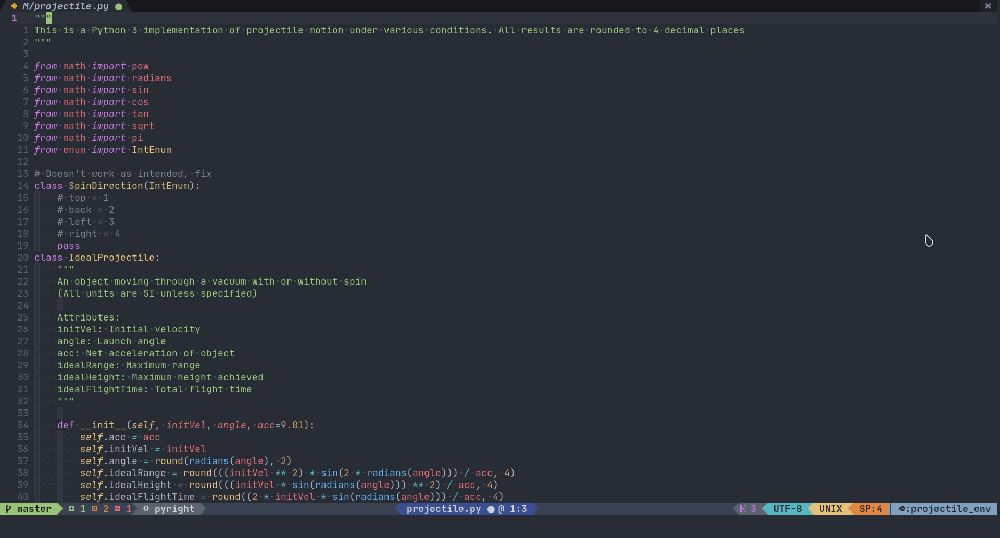

# dots
The dotfiles I use on my [Arch](https://archlinux.org) +
[ZSH](https://wiki.archlinux.org/title/Zsh) +
([Herbstluftwm](https://herbstluftwm.org/) / [i3](https://i3wm.org/)) system.
Hopefully you can find something helpful in here. :smile:

Some of the programs I use:
* [Herbstluftwm](https://herbstluftwm.org/) / [i3](https://i3wm.org/)
* [Neovim](https://neovim.io/) (Configured in [lua](https://github.com/nanotee/nvim-lua-guide))
* [Alacritty](https://alacritty.org/)
* [Polybar](https://polybar.github.io/)
* [rofi](https://github.com/davatorium/rofi)
* [ranger](https://github.com/ranger/ranger)
* [zathura](https://pwmt.org/projects/zathura/) / [sioyek](https://github.com/ahrm/sioyek)
* [starship](https://starship.rs) / [powerlevel10k](https://github.com/romkatv/powerlevel10k)

Fonts:
* JetBrainsMono Nerd Font
* FantasqueSansMono Nerd Font
* UbuntuMono Nerd Font

Get them [here](https://www.nerdfonts.com/font-downloads)

A lot scripts were inspired by or taken from those available in
[voidrice](https://github.com/LukeSmithxyz/voidrice). You should check it out!

These dotfiles are managed using [chezmoi](https://www.chezmoi.io/).

## Screenshots

> **Note:**
>
> I will not be going out of the way to maintain this for general use. It
> contains a lot of things that are specific to my use cases. Use at your own
> risk. :grimacing:
